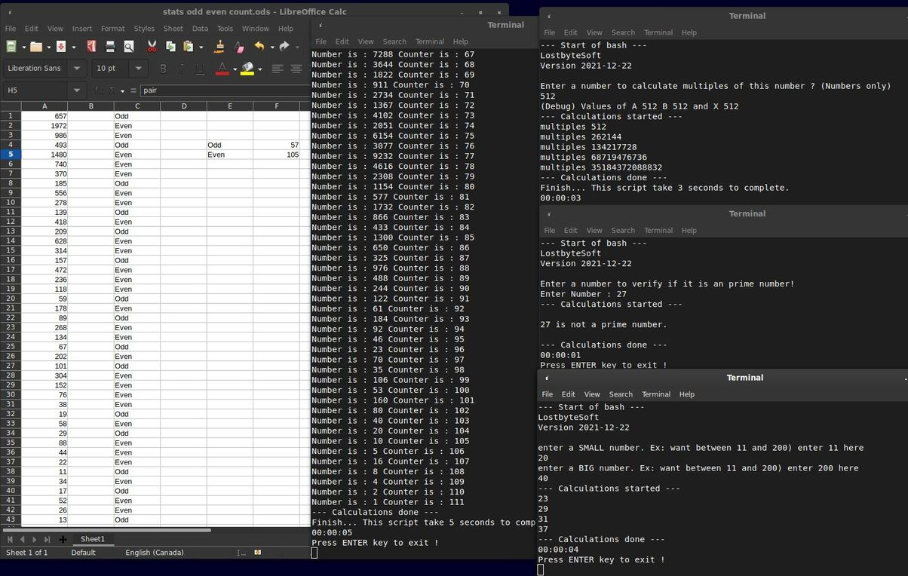
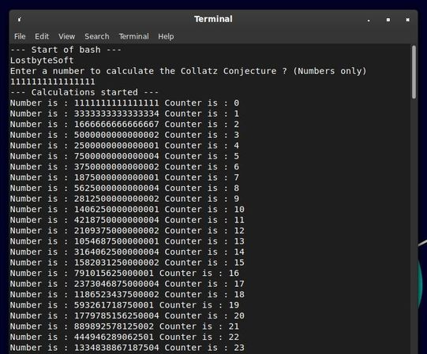
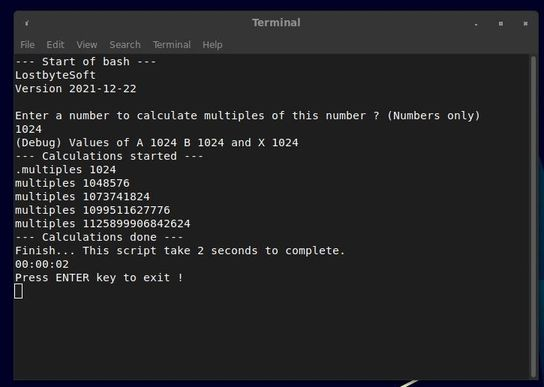

Parts of code came from here.

https://deepbsd.github.io/bash/2018/08/11/The_Collatz_Conjecture.html

--------------------------------------------------------------------

Collatz part of the solution ! This is not a proof ! But explanations !
  	
There are no number to go infinite because when you fell on 1024 multiple
you go directly to 1 (1024/2=512/2=256/2=128/2=64/2=32/2=16/2=8/2=4/2=2/2=1).
They're all divide by 2.

There are INFINITE multiples of 16 (1024) so you always return to 1 directly.
There are INFINITE multiples of 2 so you always return to 1 eventually.
And multiply *3+1 you have 17 % chance to get an odd number.
	
You have always 50 % chance to get an odd number divisible by 2 and each time
you divide by 2 and going to a loop where you get a divisible by 16 to go to 1.
	
Each time you *3+1 you have 9 % chance this number is a multiple 2-4-8-16...
16384-32768 ... etc and going to a loop where you get a divisible by 16 to go to 1.

Even very large prime numbers will end up with a multiple of 16 eventually.

The chances to get an even number are greater than an odd.
	
You have more chance to win in a casino ...

There are NO solution at Collatz.

And no proof either...

What need to do now ?

Analyse the last digit after a calculation to determine there are more chance to get an even number.

	File "Stats.txt" and "chance to get even or odd.ods" in same directory !
	
	You need copy data from stats.txt to ods file.

64 % more chances to get an avec number.
	

--------------------------------------------------------------------

Some numbers worth trying:

27, 9663, 1111111111111111, (17 numbers maximum)

--------------------------------------------------------------------

Files and what they do ?

-calculate pi.sh

	Calculate the number of decimal you specified (of pi)

-calculate prime number.sh

	Big numbers return an error.
	Calculate prime number between 2 numbers
	(Between 11 and 20 they are: 13, 17, 19)

-chance to get even or odd.ods

	Incomplete statistic

-Collatz Conjecture.sh

	17 numbers maximum.
	You specify a number and there you go.

-find multiples of a number.sh

	You gave a number and you get multiples of this number, you always going to 1 with theses numbers.

-IS a prime numbers.sh

	Determine if 7919 is a prime number ? Yes it is.
	Prime numbers give interesting results -> image 1111111111111111
	

--------------------------------------------------------------------
 
Exemple 1: 16.

  	
Exemple 2: 68719476736 * 2 = 137438953472 (multiple of 2,4 ,8, 16...etc).

68719476736 divisible dy 16

  	
Exemple 3: Prime number 7919, going to an 1024 multiple.

Find multiples of a number.

2021-12-20 and 21 dec
2021-12-22 Update

Very good video on the subject: https://www.youtube.com/watch?v=094y1Z2wpJg

--------------------------------------------------------------------

	As is customary and in compliance with current global and
	interplanetary regulations, the author of these pages disclaims
	all liability for the consequences of the advice given here,
	in particular in the event of partial or total destruction of
	the material, Loss of rights to the manufacturer warranty,
	electrocution, drowning, divorce, civil war, the effects of
	radiation due to atomic fission, unexpected tax recalls or
	encounters with extraterrestrial beings elsewhere.
	
	LostByteSoft no copyright or copyleft we are in the center.
	
--------------------------------------------------------------------

