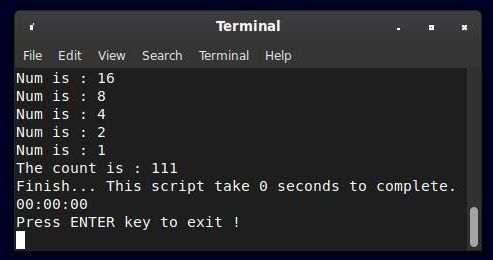
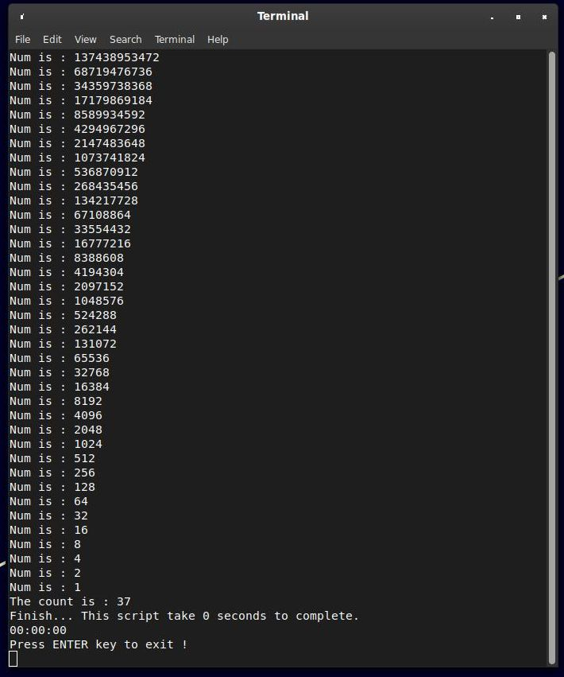
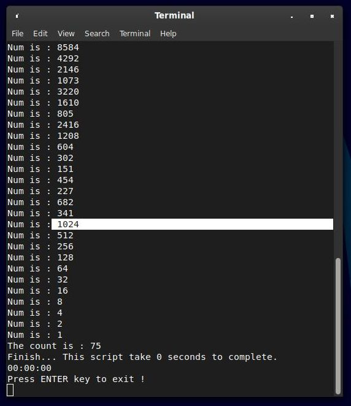

Parts of code came from here.

https://deepbsd.github.io/bash/2018/08/11/The_Collatz_Conjecture.html

--------------------------------------------------------------------

Remove the # in front of this to get a random number.

posnum=$RANDOM
  	
27 specail number

9663 special number

68719476736 divisible dy 16

Collatz part of the solution ! This is not a proof !
  	
There are no number to go infinite because when you fell on 1024 multiple
you go directly to 1 (1024/2=512/2=256/2=128/2=64/2=32/2=16/2=8/2=4/2=2/2=1).
They're all divide by 2.

There are INFINITE multiples of 16 (1024) so you always return to 1 directly.
There are INFINITE multiples of 2 so you always return to 1 eventually.
And multiply *3+1 you have 17 % chance to get an odd number.
	
You have always 50 % chance to get an odd number divisible by 2 and each time
you divide by 2 and going to a loop where you get a divisible by 16 to go to 1.
	
Each time you *3+1 you have 9 % chance this number is a multiple 2-4-8-16...
16384-32768 ... etc and going to a loop where you get a divisible by 16 to go to 1.

Even very large prime numbers will end up with a multipole of 16 eventually.
	
You have more chance to win in a casino ...

There are NO solution at Collatz.

And no proof either...
 
Exemple 1: 16.

  	
Exemple 2: 68719476736 * 2 = 137438953472 (multiple of 2,4 ,8, 16...etc).

  	
Exemple 3: Prime number 7919, going to an 1024 multiple.

--------------------------------------------------------------------

	As is customary and in compliance with current global and
	interplanetary regulations, the author of these pages disclaims
	all liability for the consequences of the advice given here,
	in particular in the event of partial or total destruction of
	the material, Loss of rights to the manufacturer warranty,
	electrocution, drowning, divorce, civil war, the effects of
	radiation due to atomic fission, unexpected tax recalls or
	encounters with extraterrestrial beings elsewhere.
	
	LostByteSoft no copyright or copyleft we are in the center.
	
--------------------------------------------------------------------
